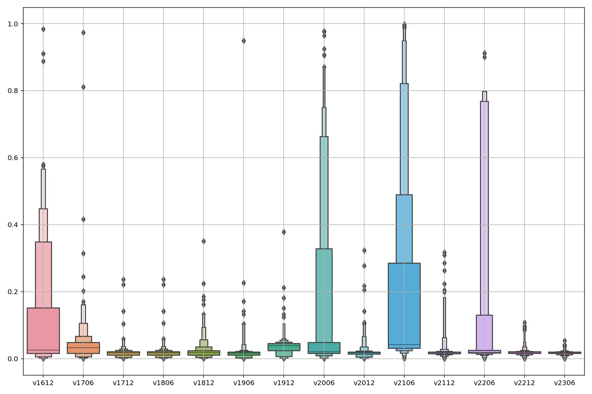
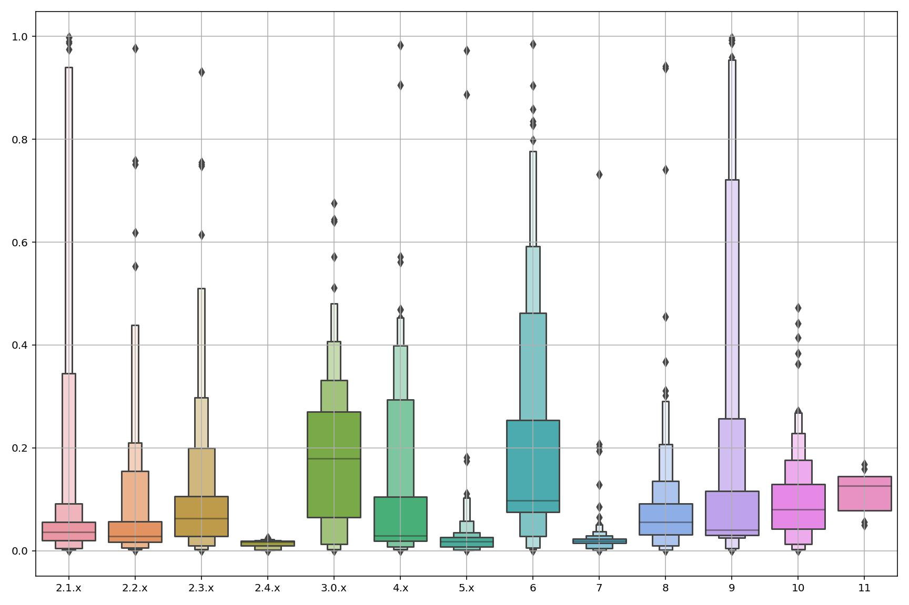
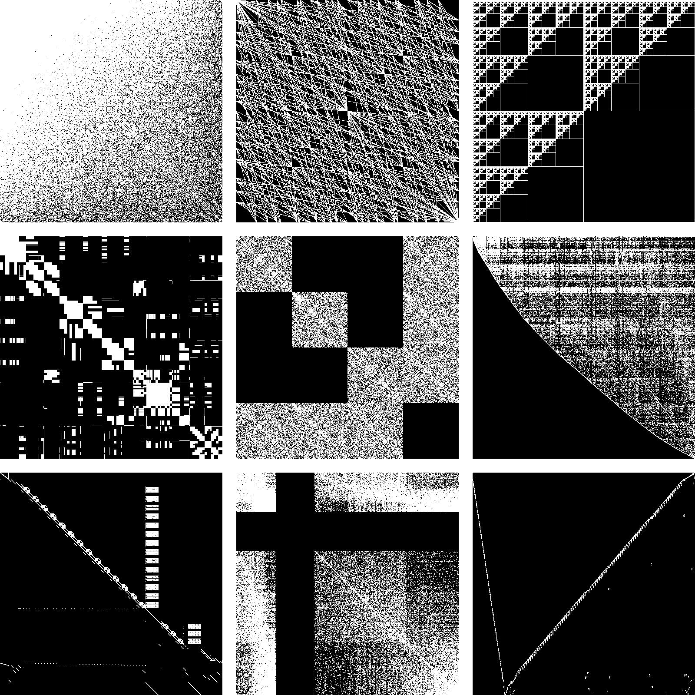

<div align="center">
  <a href="https://github.com/iydon/petsc4foam">
    🟢⬜🟩⬜🟩<br />
    ⬜⬜⬜⬜⬜<br />
    🟩⬜🟩⬜🟩<br />
    ⬜⬜⬜⬜⬜<br />
    🟩⬜🟩⬜🟩<br />
  </a>

  <h3 align="center">PETSc4FOAM</h3>

  <p align="center">
    Speed Up OpenFOAM Framework with PETSc Library (experimental)
  </p>
</div>


<!-- TABLE OF CONTENTS -->
<details open>
  <summary>Table of Contents</summary>
  <ol>
    <li><a href="#openfoamcom-or-openfoamorg">OpenFOAM.com or OpenFOAM.org</a></li>
    <li><a href="#solution-for-managing-petsc-installations">Solution for Managing PETSc Installations</a></li>
    <li><a href="#installation-of-petsc4foam">Installation of PETSc4FOAM</a></li>
    <li><a href="#test-for-petsc4foam">Test for PETSc4FOAM</a></li>
    <li>
      <a href="#hyper-parameter-optimization">Hyper-parameter Optimization</a>
      <ul>
        <li><a href="#training-dataset">Training Dataset</a></li>
      </ul>
    </li>
    <li><a href="#references">References</a></li>
  </ol>
</details>


## OpenFOAM.com or OpenFOAM.org

There are two major distributions of OpenFOAM[^1]: OpenFOAM.com (ESI-OpenCFD) and OpenFOAM.org (OpenFOAM Foundation). In order to avoid compatibility issues, we need to compare the two distributions and choose the one with the more stable API.

OpenFOAM is compiled using a customized tool named wmake, which is a further wrapper around the compilation tool Make. It can be said that wmake has a narrower scope of use, and thus is less adaptable to mainstream toolchains. Therefore, it is cumbersome to analyze OpenFOAM API compatibility at the source code level, so we currently use tutorial compatibility to reflect OpenFOAM API compatibility.

Tutorial compatibility is based on the number of lines, we use $n_0$ for the number of lines in the original file, $n_a$ for the number of lines added, and $n_d$ for the number of lines deleted, so the tutorial compatibility $C_t$ has the following formula, which is between 0 and 1, and the smaller the value, the better the compatibility.

$$
C_t = \frac{n_a + n_d}{2n_0 + n_a - n_d}
$$

Figure [1.1](#figure-1.1) and [1.2](#figure-1.2) represent the distribution of tutorial compatibility between different versions of OpenFOAM, with the horizontal coordinate representing the different versions of OpenFOAM and the vertical coordinate representing the tutorial compatibility[^2]. It can be seen that the tutorial compatibility of OpenFOAM.com is better than that of OpenFOAM.org, and therefore we use OpenFOAM.com to avoid compatibility issues as much as possible.

<figure id="figure-1.1">
  
  <figcaption>Figure 1.1: OpenFOAM.com</figcaption>
</figure>

<figure id="figure-1.2">
  
  <figcaption>Figure 1.2: OpenFOAM.org</figcaption>
</figure>


## Solution for Managing PETSc Installations

TL;DR: Our solution for managing PETSc installations[^3][^4]

Some matrices contain complex numbers, and the PETSc library needs to modify configuration options to conditionally compile a version that supports real or complex numbers; at the same time, local debugging needs to disable the optimization flag to compile a version that contains debuggable code, while HPC needs to enable the optimization flag to speed up the target code.

The installation management in the PETSc official document is relatively simple, and each switch needs to specify a number of environment variables, which makes the operation more cumbersome; at the same time, the PETSc application code compilation relies too much on Make, and basically all the compile flags and search paths are stored in the form of variables in Make, which is not conducive to switching to CMake and other standard and modern code build systems, and thus we need to implement function jumps and other functions in the local IDE.

We use Python to merge the installation management steps in the official PETSc documentation, and by presetting a number of configuration options, we realize that a single command completes the installation, configuration and other cumbersome operations, which reduces the burden on the mind.

```shell
$ ipetsc build \
    --arch advance-real-optimize \
    --arch advance-complex-optimize

$ source etc/bashrc.advance-real-optimize.sh
$ echo $PETSC_ARCH
advance-real-optimize

$ source etc/bashrc.advance-complex-optimize.sh
$ echo $PETSC_ARCH
advance-complex-optimize
```

In addition to the preset configuration options, users can also add customized configuration options to increase the flexibility of our solution. Finally, we refer to OpenFOAM's use of etc/bashrc to store compile flags and search paths as environment variables, thus allowing us to switch between different code build systems at will.

```shell
$ BASE=basic-real-optimize
$ ipetsc build \
    --arch $BASE:$BASE-amgx \
    -- \
    --download-triangle=1 \
    --download-amgx=1 \
    --download-amgx-cmake-arguments="-DMPI_CXX_COMPILE_DEFINITIONS=-lmpi" \
    --with-cuda-dir=/usr/local/cuda/
```

Moreover, it is possible to add extra features to our solution, such as:

- Visualizing sparse matrices to visually display the non-zero element distribution of the matrices, thus narrowing down the range of hyper-parameters of the solving algorithm;
- Analyzing LogView and thus quantifying the performance of the PETSc application code in order to compare different hyper-parameters of the solving algorithm;
- Generating PETSc application code templates, or configuration files for the code build systems (CMakeLists.txt, etc.).

```shell
$ ipetsc cvt \
    --input data/1/A.mtx \
    --output cache/data/1/A.npz \
    --type real --base 0

$ ipetsc spy \
    --input data/1/A.mtx \
    --output image/1.png \
    --size 1024x1024

$ ipetsc new \
    --path src/prob_real/ \
    --update  # Update cmake, makefile, vscode
$ ls --all src/prob_real/
.  ..  CMakeLists.txt  main.c  Makefile  .vscode
```


## Installation of PETSc4FOAM

PETSc4FOAM is a library that plug-in PETSc into the OpenFOAM framework[^5], OpenFOAM.com implements a version with limitations, such as not supporting certain boundary conditions[^6].

We have provided an example installation of PETSc4FOAM using Docker with the configuration file [petsc4foam.dockerfile](part/installation-of-petsc4foam/petsc4foam.dockerfile), we have not provided a test case and do not guarantee that it will still work now.


## Test for PETSc4FOAM

We use OpenFOAM-v2106 to test the performance of the PETSc4FOAM implementation. The test set comes from tutorials that can run locally for less than 300 seconds, and is taken in parallel if it can be, otherwise it defaults to serial. The PETSc solving algorithm hyper-parameters are left empty, i.e., the default values are selected. The collapsed table below shows the results of the test set.

<details>
  <summary>Test Results</summary>

| application                      | tutorial                                                                | is_parallel   |   time_foam |   time_petsc |   petsc/foam |
|:---------------------------------|:------------------------------------------------------------------------|:--------------|------------:|-------------:|-------------:|
| liquidFilmFoam                   | finiteArea/liquidFilmFoam/cylinder                                      | True          |  54.5962    |    74.5738   |     1.36591  |
| PDRFoam                          | combustion/PDRFoam/flamePropagationWithObstacles                        | False         | 126.312     |   208.068    |     1.64726  |
| fireFoam                         | combustion/fireFoam/LES/flameSpreadWaterSuppressionPanel                | False         |  62.0199    |    82.2087   |     1.32552  |
| fireFoam                         | combustion/fireFoam/LES/simplePMMApanel                                 | False         |   4.64767   |     4.54882  |     0.978731 |
| compressibleInterDyMFoam         | multiphase/compressibleInterDyMFoam/laminar/sloshingTank2D              | False         |  42.1959    |    38.6318   |     0.915535 |
| reactingTwoPhaseEulerFoam        | multiphase/reactingTwoPhaseEulerFoam/laminar/injection                  | False         |  40.289     |    49.8847   |     1.23817  |
| reactingTwoPhaseEulerFoam        | multiphase/reactingTwoPhaseEulerFoam/laminar/steamInjection             | False         | 274.909     |   459.745    |     1.67235  |
| icoReactingMultiphaseInterFoam   | multiphase/icoReactingMultiPhaseInterFoam/evaporationMultiComponent     | False         | 232.445     |   751.688    |     3.23384  |
| icoReactingMultiphaseInterFoam   | multiphase/icoReactingMultiPhaseInterFoam/inertMultiphaseMultiComponent | False         |  68.1879    |   104.234    |     1.52862  |
| twoPhaseEulerFoam                | multiphase/twoPhaseEulerFoam/laminar/injection                          | False         |  35.6297    |    46.6352   |     1.30889  |
| interIsoFoam                     | multiphase/interIsoFoam/notchedDiscInSolidBodyRotation                  | False         |   7.07395   |     7.06355  |     0.998529 |
| interIsoFoam                     | multiphase/interIsoFoam/weirOverflow                                    | False         |  13.9652    |   404.528    |    28.9669   |
| interIsoFoam                     | multiphase/interIsoFoam/discInReversedVortexFlow                        | False         |  83.1104    |    82.4318   |     0.991834 |
| interIsoFoam                     | multiphase/interIsoFoam/discInConstantFlow                              | False         |   0.796971  |     0.785794 |     0.985976 |
| interIsoFoam                     | multiphase/interIsoFoam/discInConstantFlowCyclicBCs                     | False         |   0.72161   |     0.719718 |     0.997378 |
| interCondensatingEvaporatingFoam | multiphase/interCondensatingEvaporatingFoam/condensatingVessel          | False         |  75.4212    |   207.477    |     2.75091  |
| multiphaseInterFoam              | multiphase/multiphaseInterFoam/laminar/damBreak4phase                   | False         |  32.8729    |    64.1778   |     1.9523   |
| interFoam                        | multiphase/interFoam/laminar/damBreakPermeable                          | False         |   2.37643   |    57.4663   |    24.1818   |
| interFoam                        | multiphase/interFoam/laminar/testTubeMixer                              | False         |  17.4256    |    45.6418   |     2.61924  |
| interFoam                        | multiphase/interFoam/laminar/damBreak/damBreak                          | False         |   3.30486   |    55.41     |    16.7662   |
| interFoam                        | multiphase/interFoam/RAS/damBreak/damBreak                              | False         |   2.25597   |    42.0251   |    18.6284   |
| compressibleInterFoam            | multiphase/compressibleInterFoam/laminar/depthCharge2D                  | False         |  38.0536    |    39.2199   |     1.03065  |
| compressibleMultiphaseInterFoam  | multiphase/compressibleMultiphaseInterFoam/laminar/damBreak4phase       | False         |  46.114     |    48.1891   |     1.045    |
| twoLiquidMixingFoam              | multiphase/twoLiquidMixingFoam/lockExchange                             | False         |  21.9684    |   343.478    |    15.6351   |
| compressibleInterIsoFoam         | multiphase/compressibleInterIsoFoam/laminar/depthCharge2D               | False         |  67.6197    |    57.8889   |     0.856095 |
| multiphaseEulerFoam              | multiphase/multiphaseEulerFoam/damBreak4phase                           | False         | 170.796     |   174.722    |     1.02299  |
| multiphaseEulerFoam              | multiphase/multiphaseEulerFoam/bubbleColumn                             | False         | 135.974     |   202.502    |     1.48927  |
| potentialFreeSurfaceFoam         | multiphase/potentialFreeSurfaceFoam/oscillatingBox                      | False         |  18.892     |    49.3371   |     2.61154  |
| rhoSimpleFoam                    | compressible/rhoSimpleFoam/angledDuctExplicitFixedCoeff                 | False         |  19.6578    |   405.014    |    20.6032   |
| rhoCentralFoam                   | compressible/rhoCentralFoam/shockTube                                   | False         |   0.0942714 |     0.303647 |     3.22099  |
| rhoCentralFoam                   | compressible/rhoCentralFoam/LadenburgJet60psi                           | False         |  23.3061    |    28.3209   |     1.21517  |
| rhoPimpleFoam                    | compressible/rhoPimpleFoam/laminar/sineWaveDamping                      | False         |  61.836     |    77.0334   |     1.24577  |
| rhoPimpleFoam                    | compressible/rhoPimpleFoam/RAS/angledDuctLTS                            | False         |  14.9777    |    27.1883   |     1.81526  |
| rhoPimpleFoam                    | compressible/rhoPimpleFoam/RAS/mixerVessel2D                            | False         |   8.79051   |    14.2535   |     1.62146  |
| sonicFoam                        | compressible/sonicFoam/laminar/shockTube                                | False         |   1.20951   |     1.77627  |     1.46859  |
| coalChemistryFoam                | lagrangian/coalChemistryFoam/simplifiedSiwek                            | True          |  18.605     |    20.5423   |     1.10412  |
| reactingParcelFoam               | lagrangian/reactingParcelFoam/verticalChannelLTS                        | False         | 169.547     |   273.891    |     1.61543  |
| reactingParcelFoam               | lagrangian/reactingParcelFoam/recycleParticles                          | True          |   2.64601   |     3.0002   |     1.13386  |
| reactingParcelFoam               | lagrangian/reactingParcelFoam/parcelInBox                               | False         |   0.945285  |     1.46008  |     1.54459  |
| reactingParcelFoam               | lagrangian/reactingParcelFoam/filter                                    | True          |  17.2056    |    22.1532   |     1.28756  |
| simpleReactingParcelFoam         | lagrangian/simpleReactingParcelFoam/verticalChannel                     | True          |  79.7074    |   139.06     |     1.74463  |
| shallowWaterFoam                 | incompressible/shallowWaterFoam/squareBump                              | False         |   1.68878   |     2.65668  |     1.57314  |
| pisoFoam                         | incompressible/pisoFoam/RAS/cavity                                      | True          |   9.86059   |     6.46813  |     0.655958 |
| icoFoam                          | incompressible/icoFoam/cavityMappingTest                                | True          |   0.512954  |     0.536315 |     1.04554  |
| icoFoam                          | incompressible/icoFoam/elbow                                            | False         |   0.440706  |    11.3589   |    25.7743   |
| simpleFoam                       | incompressible/simpleFoam/backwardFacingStep2D                          | False         |  45.1615    |  1106.76     |    24.5067   |
| simpleFoam                       | incompressible/simpleFoam/mixerVessel2D                                 | False         |   1.59308   |    30.9162   |    19.4065   |
| simpleFoam                       | incompressible/simpleFoam/simpleCar                                     | False         |   2.63694   |   155.473    |    58.9596   |
| SRFPimpleFoam                    | incompressible/SRFPimpleFoam/rotor2D                                    | False         |  52.5763    |  1445        |    27.4838   |
| pimpleFoam                       | incompressible/pimpleFoam/RAS/TJunctionFan                              | False         |  23.7639    |   326.105    |    13.7227   |
| solidDisplacementFoam            | stressAnalysis/solidDisplacementFoam/plateHole                          | False         |   0.0917768 |     0.490052 |     5.33961  |
| buoyantBoussinesqSimpleFoam      | heatTransfer/buoyantBoussinesqSimpleFoam/hotRoom                        | False         |   5.66248   |    20.2273   |     3.57216  |
| buoyantPimpleFoam                | heatTransfer/buoyantPimpleFoam/hotRoom                                  | False         |   9.91152   |    23.6746   |     2.38859  |
| buoyantPimpleFoam                | heatTransfer/buoyantPimpleFoam/thermocoupleTestCase                     | False         |  44.9003    |    71.4351   |     1.59097  |
| buoyantBoussinesqPimpleFoam      | heatTransfer/buoyantBoussinesqPimpleFoam/hotRoom                        | False         |   6.62563   |   200.328    |    30.2353   |
| dsmcFoam                         | discreteMethods/dsmcFoam/freeSpacePeriodic                              | False         |  33.9859    |    32.2858   |     0.949977 |
| scalarTransportFoam              | verificationAndValidation/schemes/divergenceExample                     | False         |   4.3484    |    11.4358   |     2.62989  |
| potentialFoam                    | basic/potentialFoam/pitzDaily                                           | False         |   0.104949  |     0.701211 |     6.68143  |
| potentialFoam                    | basic/potentialFoam/cylinder                                            | False         |   0.0411849 |     0.584342 |    14.1882   |
| laplacianFoam                    | basic/laplacianFoam/flange                                              | True          |   1.10576   |     1.85954  |     1.68169  |
| dnsFoam                          | DNS/dnsFoam/boxTurb16                                                   | False         |   3.31527   |    96.3216   |    29.054    |
</details>

We can see that in most cases PETSc with the default hyper-parameters does not perform as well as the OpenFOAM native implementation, and the following results are exceptional without excluding errors.

| application              | tutorial                                                   | is_parallel | time_foam | time_petsc | petsc/foam |
|:-------------------------|:-----------------------------------------------------------|:------------|----------:|-----------:|-----------:|
| fireFoam                 | combustion/fireFoam/LES/simplePMMApanel                    | False       |  4.64767  |  4.54882   | 0.978731   |
| compressibleInterDyMFoam | multiphase/compressibleInterDyMFoam/laminar/sloshingTank2D | False       | 42.1959   | 38.6318    | 0.915535   |
| interIsoFoam             | multiphase/interIsoFoam/notchedDiscInSolidBodyRotation     | False       |  7.07395  |  7.06355   | 0.998529   |
| interIsoFoam             | multiphase/interIsoFoam/discInReversedVortexFlow           | False       | 83.1104   | 82.4318    | 0.991834   |
| interIsoFoam             | multiphase/interIsoFoam/discInConstantFlow                 | False       |  0.796971 |  0.785794  | 0.985976   |
| interIsoFoam             | multiphase/interIsoFoam/discInConstantFlowCyclicBCs        | False       |  0.72161  |  0.719718  | 0.997378   |
| compressibleInterIsoFoam | multiphase/compressibleInterIsoFoam/laminar/depthCharge2D  | False       | 67.6197   | 57.8889    | 0.856095   |
| pisoFoam                 | incompressible/pisoFoam/RAS/cavity                         | True        |  9.86059  |  6.46813   | 0.655958   |
| dsmcFoam                 | discreteMethods/dsmcFoam/freeSpacePeriodic                 | False       | 33.9859   | 32.2858    | 0.949977   |

Next, we demonstrate the feasibility of tuning PETSc4FOAM via hyper-parameters by optimizing PETSc hyper-parameters to shorten the program runtime, we choose tutorial [multiphaseInterFoam-mixerVessel2D](https://develop.openfoam.com/Development/openfoam/-/tree/OpenFOAM-v2106/tutorials/multiphase/multiphaseInterFoam/laminar/mixerVessel2D), and here are the tuning result:

- Native tutorial: $48.04 \pm 0.45$ seconds
- PETSc solver with default hyper-parameters: $443.11 \pm 5.91$ seconds
- PETSc solver with tuned hyper-parameters: $48.03 \pm 0.42$ seconds

<details>
  <summary>Tuned Hyper-parameters (fvSolution)</summary>

```c++
solvers {
    "alpha.*" {
        nAlphaCorr 4;
        nAlphaSubCycles 4;
        cAlpha 1;
    }
    "pcorr.*" {
        solver petsc;
        tolerance 1e-10;
        relTol 0;
        petsc {
            options {
                ksp_type bicg;
                pc_type bjacobi;
                sub_pc_type ilu;
            }
            use_petsc_residual_norm false;
            monitor_foam_residual_norm false;
            caching {
                matrix {
                    update always;
                }
                preconditioner {
                    update always;
                }
            }
        }
    }
    p_rgh {
        solver petsc;
        tolerance 1e-07;
        relTol 0.05;
        petsc {
            options {
                ksp_type cg;
                pc_type cholesky;
                sub_pc_type ilu;
            }
            use_petsc_residual_norm false;
            monitor_foam_residual_norm false;
            caching {
                matrix {
                    update always;
                }
                preconditioner {
                    update always;
                }
            }
        }
    }
    p_rghFinal {
        solver petsc;
        tolerance 1e-07;
        relTol 0;
        petsc {
            options {
                ksp_type bicg;
                pc_type bjacobi;
                sub_pc_type ilu;
            }
            use_petsc_residual_norm false;
            monitor_foam_residual_norm false;
            caching {
                matrix {
                    update always;
                }
                preconditioner {
                    update always;
                }
            }
        }
    }
    "(U|T).*" {
        solver petsc;
        tolerance 1e-08;
        relTol 0;
        petsc {
            options {
                ksp_type cg;
                pc_type bjacobi;
                sub_pc_type ilu;
            }
            use_petsc_residual_norm false;
            monitor_foam_residual_norm false;
            caching {
                matrix {
                    update always;
                }
                preconditioner {
                    update always;
                }
            }
        }
    }
}
```
</details>


## Hyper-parameter Optimization

### Training Dataset

To optimize the hyper-parameters, we find the sparse matrix dataset SuiteSparse Matrix Collection[^7], but upon visualization, we find that many of the sparse matrices are from non-CFD domains and could not be solved as linear systems. As in Figure [5.1.1](#figure-5.1.1), certain sparse matrices are visualized, with black representing zero elements and white representing non-zero elements.

<figure id="figure-5.1.1">
  
  <figcaption>Figure 5.1.1: Sparsity Pattern of Certain Matrices in SuiteSparse Matrix Collection</figcaption>
</figure>

The available training dataset is too small, we come up with an idea to dump sparse matrices from the OpenFOAM tutorial for constructing the training dataset. Therefore, we plug-in OpenFOAM to implement this idea. We have implemented the function to dump OpenFOAM lduMatrix to matrix market format, which does not yet take into account of certain boundary conditions, but is sufficient as a training dataset. Figure [5.1.2](#figure-5.1.2) shows the mixing elbow case that comes with the icoFoam solver, and Figure [5.1.3](#figure-5.1.3) shows a visualization of the dumped $U_x$ matrix at the first time step.

<figure id="figure-5.1.2">
  
  <figcaption>Figure 5.1.2</figcaption>
</figure>

<figure id="figure-5.1.3">
  
  <figcaption>Figure 5.1.3</figcaption>
</figure>


## References

[^1]: https://www.cfd-online.com/Forums/openfoam/197150-openfoam-com-versus-openfoam-org-version-use.html
[^2]: https://seaborn.pydata.org/generated/seaborn.boxenplot.html
[^3]: https://gitlab.com/Iydon/solver_challenge
[^4]: https://github.com/iydon/iPETSc
[^5]: https://www.semanticscholar.org/paper/PETSc4FOAM%3A-a-library-to-plug-in-PETSc-into-the-Bn%C3%A0-Spisso/0234a490ba9a3647a5ed4f35bee9a70f07cb2e49
[^6]: https://develop.openfoam.com/modules/external-solver
[^7]: https://sparse.tamu.edu/
